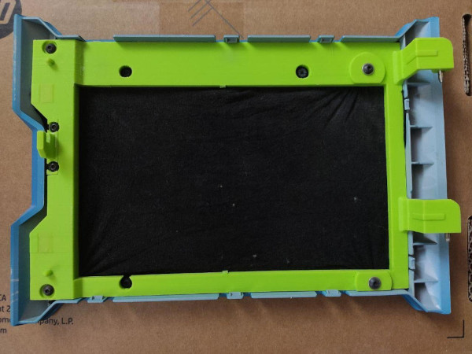

# HP Microserver Gen8 FrontDoor STL
STL recreation of HP Microserver Gen8 Front door. Hook needs to be assembled to base, with the same screws you would use to mount front panel (3 mm diameter, 7.5 mm width [screw head included]).

You also need to mount mounting bolts somehow, I used heated them and inserted to door base, they are 3 mm in diameter.

